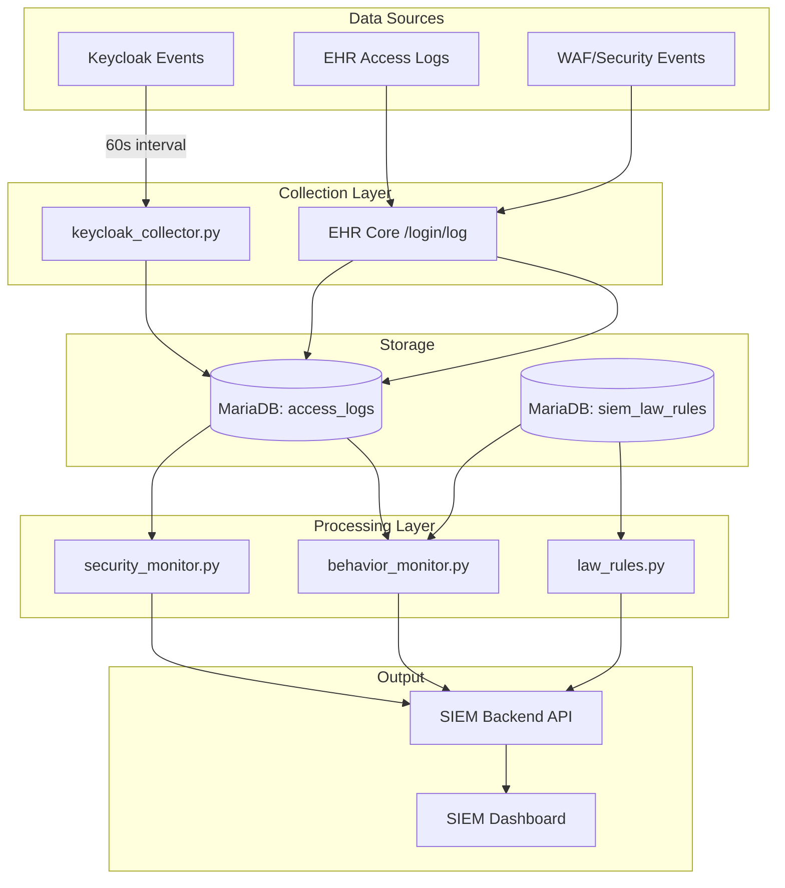
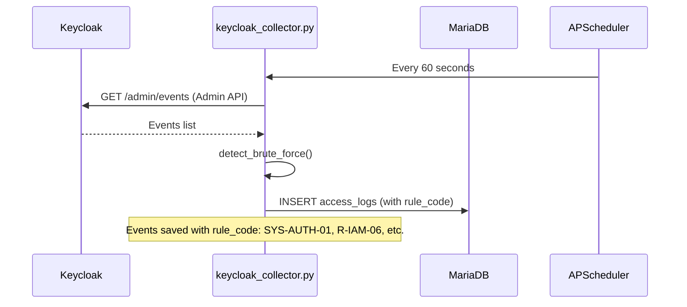
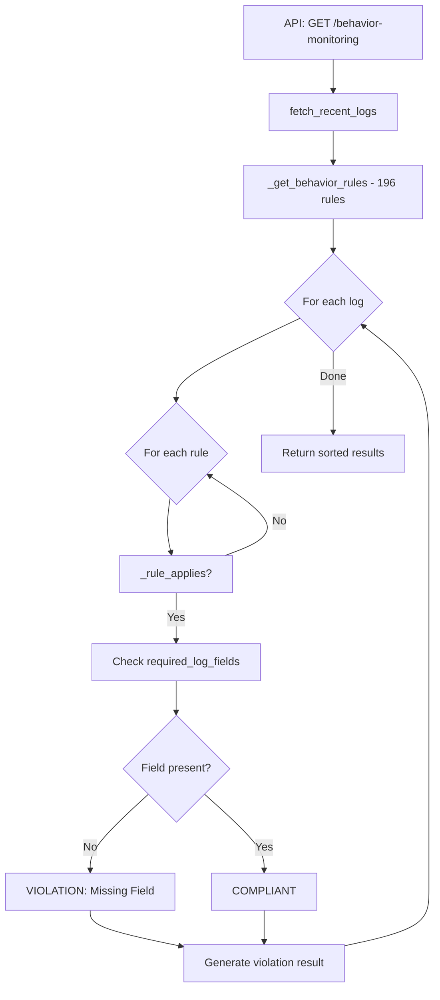
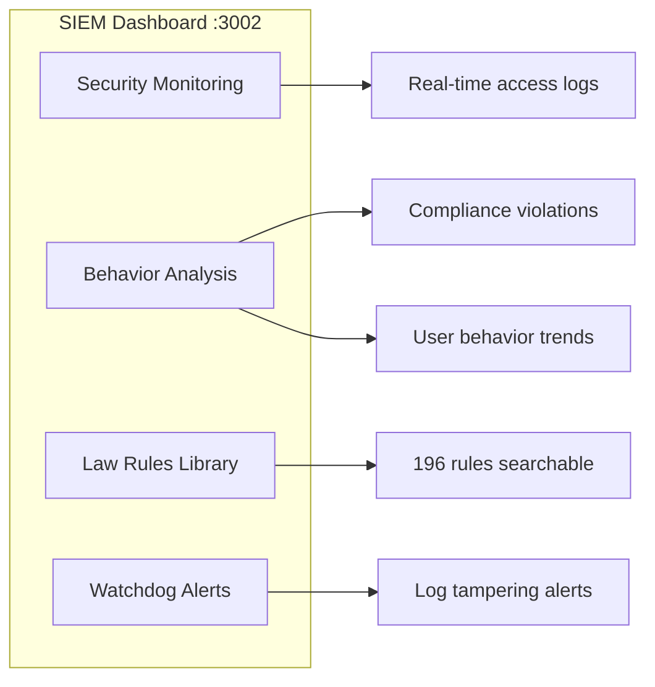
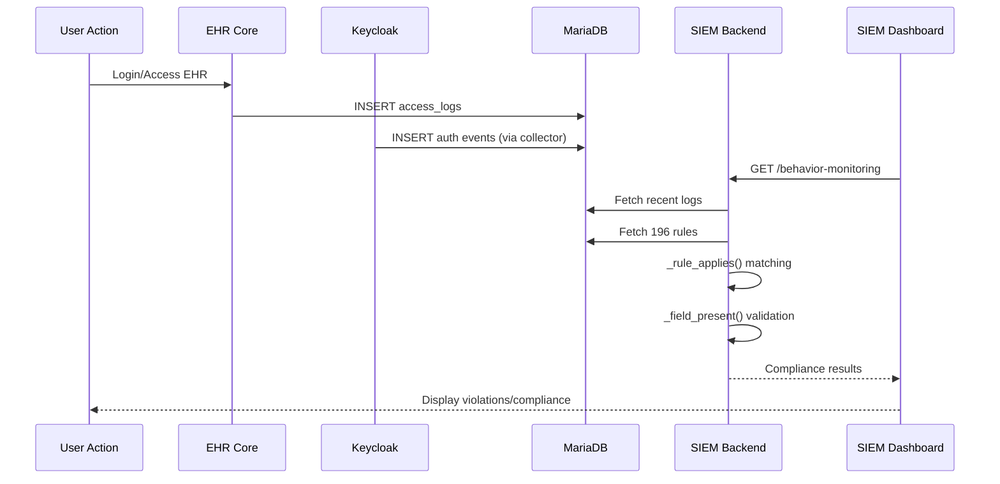
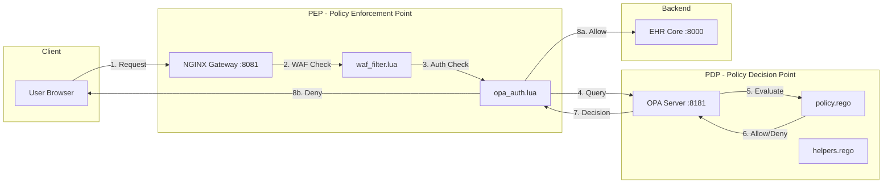
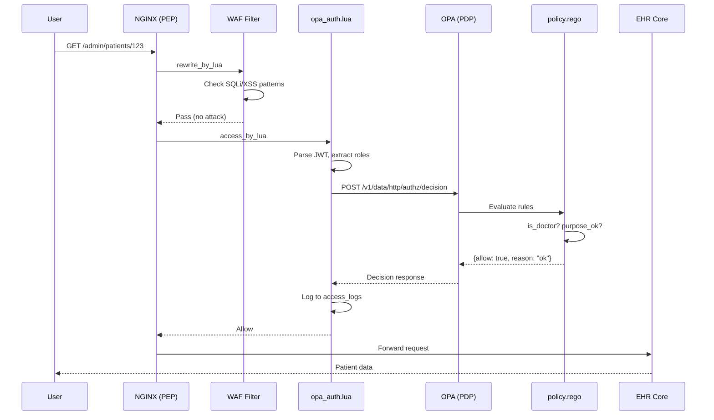

# SIEM & Compliance Checking - Deep Dive Documentation

## 📋 Mục lục
1. [Tổng quan kiến trúc](#1-tổng-quan-kiến-trúc)
2. [Cấu trúc code và vị trí file](#2-cấu-trúc-code-và-vị-trí-file)
3. [Luồng code hoạt động](#3-luồng-code-hoạt-động)
4. [Cơ chế Rule Matching](#4-cơ-chế-rule-matching)
5. [Database Schema & Rule Structure](#5-database-schema--rule-structure)
6. [Import Rules vào Database](#6-import-rules-vào-database)
7. [Kết quả đầu ra](#7-kết-quả-đầu-ra)
8. [**PDP/PEP Architecture (Policy Decision/Enforcement Point)**](#8-pdppep-architecture)


---

## 1. Tổng quan kiến trúc



---

## 2. Cấu trúc code và vị trí file

### Thư mục: `Stack_C/backend/app/`

| File | Dòng | Chức năng |
|------|------|-----------|
| [main.py](file:///g:/DoAnVV/sunflower2_full/ehr_migration_package/Stack_C/backend/app/main.py) | 1,092 | API endpoints (54 routes) |
| [behavior_monitor.py](file:///g:/DoAnVV/sunflower2_full/ehr_migration_package/Stack_C/backend/app/behavior_monitor.py) | 2,150 | **CORE**: Rule matching logic |
| [security_monitor.py](file:///g:/DoAnVV/sunflower2_full/ehr_migration_package/Stack_C/backend/app/security_monitor.py) | 600 | Query access_logs |
| [law_rules.py](file:///g:/DoAnVV/sunflower2_full/ehr_migration_package/Stack_C/backend/app/law_rules.py) | 297 | CRUD for siem_law_rules |
| [keycloak_collector.py](file:///g:/DoAnVV/sunflower2_full/ehr_migration_package/Stack_C/backend/app/keycloak_collector.py) | 379 | Auth event collection |
| [user_service.py](file:///g:/DoAnVV/sunflower2_full/ehr_migration_package/Stack_C/backend/app/user_service.py) | 570 | User management |
| [ai/](file:///g:/DoAnVV/sunflower2_full/ehr_migration_package/Stack_C/backend/app/ai) | - | Gemini/OpenAI integration |

---

## 3. Luồng code hoạt động

### 3.1 Luồng Thu thập Logs



**Code location**: [keycloak_collector.py#L297-372](file:///g:/DoAnVV/sunflower2_full/ehr_migration_package/Stack_C/backend/app/keycloak_collector.py#L297-372)

### 3.2 Luồng Behavior Monitoring (CORE)



**Code location**: [behavior_monitor.py#L357-886](file:///g:/DoAnVV/sunflower2_full/ehr_migration_package/Stack_C/backend/app/behavior_monitor.py#L357-886)

---

## 4. Cơ chế Rule Matching

### 4.1 Hàm `_rule_applies()` - Logic quyết định rule áp dụng cho log

```python
# File: behavior_monitor.py, Lines 357-886

def _rule_applies(self, rule: Dict, log: Dict) -> bool:
    """
    Quyết định rule có áp dụng cho log không dựa trên:
    1. rule_code prefix (SYS-, R-, EMR-, RX-, etc.)
    2. log_type (session_log, emr_access_log, etc.)
    3. functional_group
    4. purpose (authentication, system_compliance, etc.)
    """
```

### 4.2 Rule Prefix Mapping

| Rule Prefix | Log Types áp dụng | Mô tả |
|-------------|-------------------|-------|
| `SYS-AUTH-` | authentication logs | Xác thực, session |
| `SYS-TLS-` | network_log, api_log | TLS/SSL compliance |
| `SYS-DLP-` | data_access_log | Data Loss Prevention |
| `SYS-BKP-` | backup_encryption_log | Backup compliance |
| `SYS-ENC-` | backup_encryption_log | Encryption compliance |
| `R-SEC-` | security_alert, waf_block | SQL Injection, XSS |
| `R-IAM-` | authentication | Brute-force, lockout |
| `EMR-READ-` | emr_access_log | Xem hồ sơ |
| `EMR-UPDATE-` | emr_access_log | Cập nhật hồ sơ |
| `RX-` | prescription_log | Kê đơn thuốc |

### 4.3 Field Validation

```python
# File: behavior_monitor.py, Lines 904-1000+

def _field_present(self, log: Dict, field_name: str) -> bool:
    """
    Kiểm tra field có trong log không.
    - Hỗ trợ field aliases (patient_id = patient_code = mã bệnh nhân)
    - Tìm trong: log, details, request_body, response_body
    """
    field_aliases = {
        'patient_id': ['patient_id', 'patient_code', 'mã bệnh nhân'],
        'user_id': ['user_id', 'actor_id', 'actor_name', 'username'],
        'session_id': ['session_id', 'event_id', 'log_id', 'id'],
        # ...
    }
```

---

## 5. Database Schema & Rule Structure

### 5.1 Bảng `siem_law_rules` (196 rules)

```sql
-- File: law_rules.py, Lines 37-58

CREATE TABLE siem_law_rules (
    id INT AUTO_INCREMENT PRIMARY KEY,
    law_source VARCHAR(255),           -- "Bộ tiêu chí CNTT BYT", "Nghị định 13/2023"
    rule_code VARCHAR(50) UNIQUE,      -- "R-AUD-07", "SYS-AUTH-01"
    rule_name TEXT,                    -- Tên rule tiếng Việt
    allowed_status ENUM('required', 'allowed', 'not_allowed', 'conditional'),
    legal_basis TEXT,                  -- Căn cứ pháp lý
    explanation TEXT,                  -- Giải thích chi tiết
    required_log_fields JSON,          -- ["username", "ip_address", "session_id"]
    functional_group VARCHAR(255),     -- "PHẦN IV – GHI VẾT, KIỂM TOÁN"
    penalty_level VARCHAR(50),         -- Mức xử phạt
    law_url TEXT                       -- Link đến văn bản pháp luật
);
```

### 5.2 Ví dụ Rule trong Database

| id | rule_code | rule_name | required_log_fields | functional_group |
|----|-----------|-----------|---------------------|------------------|
| 1 | R-AUD-07 | Lưu log định dạng chuẩn JSON | `["json_valid=true", "schema_version"]` | PHẦN IV – GHI VẾT |
| 2 | SYS-AUTH-01 | Xác thực thành công | `["username", "ip_address", "session_id"]` | PHẦN II – XÁC THỰC |
| 3 | R-IAM-06 | Brute-force Protection | `["is_brute_force", "username"]` | PHẦN II – XÁC THỰC |
| 4 | R-SEC-01 | Chống SQL Injection | `["attack_type", "matched_pattern"]` | PHẦN V – BẢO MẬT |

### 5.3 Bảng `access_logs` (Log storage)

```sql
-- Logs từ EHR và Keycloak

CREATE TABLE access_logs (
    id VARCHAR(36) PRIMARY KEY,
    timestamp TIMESTAMP,
    user_id VARCHAR(255),
    actor_name VARCHAR(255),
    role VARCHAR(100),
    action TEXT,                -- "Đăng nhập thành công", "Xem hồ sơ bệnh án"
    operation VARCHAR(50),      -- "view", "update", "create"
    method VARCHAR(10),         -- "GET", "POST", "PUT"
    status INT,                 -- 200, 401, 403
    purpose VARCHAR(100),       -- "authentication", "system_compliance"
    patient_id VARCHAR(36),
    uri TEXT,
    ip_address VARCHAR(45),
    details JSON,               -- Contains rule_code, rule_name from Keycloak
    log_type VARCHAR(50)        -- "SESSION_LOG", "SECURITY_ALERT"
);
```

---

## 6. Import Rules vào Database

### 6.1 Phương pháp Import

**Cách 1: SQL Backup (Hiện tại)**

Rules được import qua file `database_backup.sql`:
```sql
-- File: database_backup.sql, Lines 265211-265408

INSERT INTO siem_law_rules VALUES
(1,'Bộ tiêu chí CNTT BYT','R-AUD-07','Lưu log định dạng chuẩn JSON','allowed',...),
(2,'Bộ tiêu chí CNTT BYT','R-DAM-17','Chỉ cho phép API FHIR/HL7','allowed',...),
...
(196,'Nghị định 13/2023','SYS-DSR-04','Quyền xóa dữ liệu cá nhân','required',...);
```

**Cách 2: API Endpoint**

```python
# File: main.py, Lines 196-203

@app.post("/api/law-rules")
def create_rule(rule: LawRuleResponse):
    """Create a new rule manually"""
    repo = LawRuleRepository()
    return repo.create_rule(rule.dict())
```

**Cách 3: AI Document Import**

```python
# File: main.py, Lines 137-194

@app.post("/api/import-document")
async def import_document(file: UploadFile):
    """Import law document and extract rules using AI"""
    # Uses Gemini/OpenAI to parse legal documents
    # and extract compliance rules automatically
```

### 6.2 Code tạo Rule mới

```python
# File: law_rules.py, Lines 124-162

def create_rule(self, rule: Dict[str, Any]) -> Dict[str, Any]:
    cursor.execute("""
        INSERT INTO siem_law_rules 
        (law_source, rule_code, rule_name, allowed_status, legal_basis,
         explanation, required_log_fields, functional_group, tags)
        VALUES (%s, %s, %s, %s, %s, %s, %s, %s, %s)
    """, (...))
```

---

## 7. Kết quả đầu ra

### 7.1 API Response Format

```json
// GET /api/behavior-monitoring

{
  "total": 150,
  "page": 1,
  "results": [
    {
      "log_id": "abc123",
      "timestamp": "2025-12-26T10:30:00",
      "actor_name": "doctor.nguyen",
      "role": "doctor",
      "action": "Xem hồ sơ bệnh án",
      "rule_code": "EMR-READ-01",
      "rule_name": "Ghi nhận truy cập hồ sơ",
      "status": "compliant",           // or "violation"
      "violation_type": null,          // or "Missing Field"
      "missing_fields": []             // or ["patient_id", "purpose"]
    }
  ]
}
```

### 7.2 Compliance Status Types

| Status | Nghĩa | Màu hiển thị |
|--------|-------|--------------|
| `compliant` | Tuân thủ đầy đủ | 🟢 Xanh |
| `violation` | Vi phạm | 🔴 Đỏ |
| `warning` | Cảnh báo | 🟡 Vàng |

### 7.3 Violation Types

| Type | Mô tả |
|------|-------|
| `Missing Field` | Thiếu trường bắt buộc theo rule |
| `Unauthorized Access` | Truy cập không được phép |
| `Brute Force` | Phát hiện tấn công brute-force |
| `SQL Injection` | Phát hiện SQL Injection |
| `XSS Attack` | Phát hiện Cross-Site Scripting |

### 7.4 Dashboard Output



---

## 8. Tóm tắt luồng End-to-End



---

## 8. PDP/PEP Architecture (Policy Decision/Enforcement Point)

### 8.1 Kiến trúc tổng quan



### 8.2 Vị trí code PDP/PEP

| Component | File | Lines | Chức năng |
|-----------|------|-------|-----------|
| **PDP** | [policy.rego](file:///g:/DoAnVV/sunflower2_full/ehr_migration_package/ehr-gw/opa/policies/policy.rego) | 1,759 | RBAC rules cho 11 roles |
| **PDP Helper** | [helpers.rego](file:///g:/DoAnVV/sunflower2_full/ehr_migration_package/ehr-gw/opa/policies/helpers.rego) | 142 | Path parsing, data classification |
| **PEP** | [opa_auth.lua](file:///g:/DoAnVV/sunflower2_full/ehr_migration_package/ehr-gw/gateway/lua/opa_auth.lua) | 623 | OPA integration, JWT parsing, logging |
| **WAF** | [waf_filter.lua](file:///g:/DoAnVV/sunflower2_full/ehr_migration_package/ehr-gw/gateway/lua/waf_filter.lua) | 232 | SQLi/XSS detection |
| **Routing** | [nginx.conf](file:///g:/DoAnVV/sunflower2_full/ehr_migration_package/ehr-gw/gateway/nginx.conf) | 337 | Location blocks + WAF/OPA integration |

### 8.3 Policy.rego - 11 Roles RBAC

```rego
# File: policy.rego, Lines 1-100

package http.authz
default allow = false

# 11 VAI TRÒ (CÓ PHÂN CẤP)
is_receptionist if { roles[_] == "receptionist" }
is_head_reception if { roles[_] == "head_reception" }  # 👑 Trưởng
is_doctor if { roles[_] == "doctor" }
is_nurse if { roles[_] == "nurse" }
is_head_nurse if { roles[_] == "head_nurse" }          # 👑 Trưởng
is_pharmacist if { roles[_] == "pharmacist" }
is_lab_technician if { roles[_] == "lab_technician" }
is_accountant if { roles[_] == "accountant" }
is_admin_hospital if { roles[_] == "admin_hospital" }  # Giám đốc
is_admin if { roles[_] == "admin" }                    # Admin CNTT
is_patient if { roles[_] == "patient" }
```

### 8.4 Purpose Validation

```rego
# Mục đích được phép cho từng role
allowed_purposes := {"treatment", "care", "emergency", "audit", 
                     "billing", "research", "patient_access"}

doctor_purpose_ok if {
  is_doctor
  doctor_allowed_purposes := {"treatment", "care", "emergency"}
  doctor_allowed_purposes[input.purpose]
}

pharmacist_purpose_ok if {
  is_pharmacist
  input.purpose == "treatment"
}
```

### 8.5 Helpers.rego - Data Classification

```rego
# File: helpers.rego, Lines 40-60

# Dữ liệu nhạy cảm cao: Tâm thần, HIV, Di truyền, Ung thư
is_data_type(path, "HIGHLY_SENSITIVE") if {
  highly_sensitive_resources := {
    "Condition",        # Chẩn đoán tâm thần, HIV
    "Observation",      # Xét nghiệm HIV, di truyền
    "DiagnosticReport", # Báo cáo chẩn đoán
    "Procedure"         # Thủ thuật liên quan
  }
  highly_sensitive_resources[parts[1]]
}
```

### 8.6 opa_auth.lua - PEP Implementation

```lua
-- File: opa_auth.lua, Lines 198-250

-- Xây dựng input gửi cho OPA
local input = {
  method = method,
  path = path_only,
  user = {
    id = user_id,
    roles = user_roles,
    dept = user_dept,
  },
  purpose = purpose,
  mfa = to_bool(get_header("X-MFA")),
}

-- Gọi OPA để lấy quyết định
local res = httpc:request_uri(opa_url, {
  method = "POST",
  body = cjson.encode({ input = input }),
})

-- Xử lý kết quả từ OPA
if decision.allow then
  ngx.header["X-Decision"] = "permit"
  -- Log allowed access và forward to backend
else
  ngx.header["X-Decision"] = "deny"
  ngx.exit(ngx.HTTP_FORBIDDEN)
end
```

### 8.7 nginx.conf - Location Routing

```nginx
# File: nginx.conf, Lines 46-63

# PEP bảo vệ FHIR API
location /fhir/ {
  rewrite_by_lua_file /etc/nginx/lua/waf_filter.lua;  # WAF trước
  access_by_lua_file /etc/nginx/lua/opa_auth.lua;     # OPA sau
  proxy_pass $backend;
}

# PEP bảo vệ Admin API
location /admin/ {
  rewrite_by_lua_file /etc/nginx/lua/waf_filter.lua;
  access_by_lua_file /etc/nginx/lua/opa_auth.lua;
  proxy_pass http://ehr-core:8000;
}
```

### 8.8 Authorization Flow



### 8.9 Permission Matrix

| Role | /patients | /appointments | /prescriptions | /billing | /admin |
|------|-----------|---------------|----------------|----------|--------|
| receptionist | ✅ GET/POST | ✅ ALL | ❌ | ✅ | ❌ |
| doctor | ✅ GET | ✅ GET | ✅ ALL | ❌ | ❌ |
| nurse | ✅ GET | ✅ GET | ❌ | ❌ | ❌ |
| pharmacist | ❌ | ❌ | ✅ GET | ❌ | ❌ |
| accountant | ❌ | ❌ | ❌ | ✅ ALL | ❌ |
| admin | ❌ | ❌ | ❌ | ❌ | ✅ ALL |

---

### 8.10 OPA Input Structure (Chi tiết)

Khi Gateway gọi OPA, payload JSON có cấu trúc sau:

```json
// File: opa_auth.lua, Lines 199-218
{
  "input": {
    "method": "GET",              // HTTP method
    "path": "/admin/patients/123", // URI path (không có query string)
    "query": "page=1&limit=10",   // Query parameters
    "ip": "192.168.1.100",        // Client IP
    "request_id": "abc123",       // Request tracing ID
    "local_hour": 14,             // Giờ Việt Nam (UTC+7)
    
    "user": {
      "id": "bs.noikhoa",         // Username hoặc UUID
      "roles": ["doctor", "offline_access"], // Danh sách roles từ Keycloak
      "dept": "internal_medicine" // Khoa/phòng
    },
    
    "patient": "P001",            // Patient ID từ header X-Patient
    "patient_dept": "cardiology", // Patient's department
    "purpose": "treatment",       // Mục đích truy cập
    "mfa": true,                  // Đã xác thực 2 yếu tố
    "consent": true               // Đã có consent
  }
}
```

### 8.11 Rule Conditions (Điều kiện trong policy.rego)

#### Cấu trúc một PERMIT rule:

```rego
// File: policy.rego, Lines 283-289

# Pattern: base_allow if { ĐIỀU KIỆN 1, ĐIỀU KIỆN 2, ... }
base_allow if {
  is_receptionist           # ① Kiểm tra role
  receptionist_purpose_ok   # ② Kiểm tra purpose hợp lệ
  is_patients_list          # ③ Kiểm tra path pattern
  input.method == "POST"    # ④ Kiểm tra HTTP method
}
```

#### Các loại điều kiện:

| Loại | Ví dụ | Mô tả |
|------|-------|-------|
| **Role check** | `is_doctor` | Kiểm tra user có role trong `input.user.roles` |
| **Purpose check** | `doctor_purpose_ok` | Kiểm tra `input.purpose` trong allowed_purposes |
| **Path check** | `is_specific_patient` | Kiểm tra `input.path` match pattern |
| **Method check** | `input.method == "GET"` | Kiểm tra HTTP method |
| **Auth check** | `input.user.id` | Kiểm tra user đã authenticated |

### 8.12 Deny Rules (Quy tắc từ chối)

```rego
// File: policy.rego, Lines 1659-1714

# DENY 1: Mục đích không hợp lệ
reasons[r] if {
  not purpose_ok
  r := "purpose_not_allowed"
}

# DENY 2: Research không có consent
reasons[r] if {
  input.purpose == "research"
  not research_ok
  r := "research_policy_violation"
}

# DENY 3: Doctor không được xem danh sách tất cả bệnh nhân
reasons[r] if {
  is_doctor
  is_patients_list
  input.method == "GET"
  r := "doctor_cannot_list_all_patients"
}

# DENY 4: Receptionist không được xem nội dung y tế
reasons[r] if {
  is_receptionist
  is_patient_diagnoses  # hoặc is_patient_prescriptions, is_patient_lab_orders
  r := "receptionist_cannot_access_medical_content"
}

# DENY 5: Admin CNTT không được xem dữ liệu lâm sàng
reasons[r] if {
  is_admin
  helpers.is_clinical_path(input.path)
  r := "it_admin_clinical_access_denied"
}

# DENY 6: Chỉ Admin được DELETE
reasons[r] if {
  input.method == "DELETE"
  not is_admin
  r := "delete_not_allowed"
}
```

### 8.13 Final Decision Logic

```rego
// File: policy.rego, Lines 1716-1758

# Quyết định cuối cùng: allow = true NẾU:
# 1. base_allow = true (có rule cho phép)
# 2. count(reasons) == 0 (không có deny rule nào match)

allow if {
  base_allow
  count(reasons) == 0
}

# Break-the-glass: Truy cập khẩn cấp (emergency)
allow if {
  is_break_the_glass        # purpose == "emergency" + có emergency_reason
  input.method == "GET"     # Chỉ cho phép đọc
}

# Response endpoint cho Gateway
decision := {
  "allow": allow,           # true/false
  "reason": reason,         # "ok" hoặc deny reason
  "obligations": obligations # Actions bắt buộc (logging, etc.)
}
```

### 8.14 Import Rules - Phương pháp nạp policy

**OPA không dùng database** - Rules được load từ file `.rego`:

```yaml
# File: docker-compose.yml, OPA service

opa:
  image: openpolicyagent/opa:latest
  command: "run --server --addr=:8181 /policies"
  volumes:
    - ./ehr-gw/opa/policies:/policies:ro  # Mount policy files
```

**Các file được load:**

| File | Mô tả |
|------|-------|
| `policy.rego` | 1759 rules chính |
| `helpers.rego` | 142 helper functions |

**Reload policy (không cần restart):**
```bash
# PUT new policy via API
curl -X PUT http://localhost:8181/v1/policies/authz \
  --data-binary @policy.rego
```

### 8.15 Output Format - Kết quả từ OPA

```json
// Response từ OPA khi ALLOW
{
  "result": {
    "allow": true,
    "reason": "ok",
    "obligations": []
  }
}

// Response từ OPA khi DENY
{
  "result": {
    "allow": false,
    "reason": "doctor_cannot_list_all_patients",
    "obligations": []
  }
}
```

**Gateway xử lý response:**

```lua
-- File: opa_auth.lua, Lines 249-255

if decision.allow then
  ngx.header["X-Decision"] = "permit"
  -- Forward request to backend
else
  ngx.header["X-Decision"] = "deny"
  ngx.status = 403
  ngx.say({ error = decision.reason })
  ngx.exit(ngx.HTTP_FORBIDDEN)
end
```

### 8.16 Break-the-Glass (Truy cập khẩn cấp)

```rego
// File: policy.rego, Lines 130-133

is_break_the_glass if {
  input.purpose == "emergency"
  input.request.emergency_reason != ""  # Phải có lý do
}

// Lines 1745-1749
allow if {
  is_break_the_glass
  input.method == "GET"  # Chỉ được đọc, không được sửa/xoá
}
```

**Khi Break-the-glass xảy ra:**
- ✅ Bypass tất cả deny rules
- ✅ Ghi log đặc biệt cho audit
- ❌ Không cho phép DELETE/PUT

---

## 9. So sánh SIEM Rules vs OPA Rules

| Khía cạnh | SIEM (behavior_monitor.py) | OPA (policy.rego) |
|-----------|---------------------------|-------------------|
| **Số rules** | 196 rules trong database | ~1759 lines rules |
| **Lưu trữ** | MariaDB `siem_law_rules` | File `.rego` |
| **Ngôn ngữ** | Python + SQL | Rego (OPA-specific) |
| **Thời điểm check** | Sau khi action hoàn thành | Trước khi action thực hiện |
| **Mục đích** | Compliance monitoring | Access control |
| **Output** | Violation/Compliant | Allow/Deny |
| **Import** | SQL INSERT hoặc API | Volume mount hoặc PUT API |
