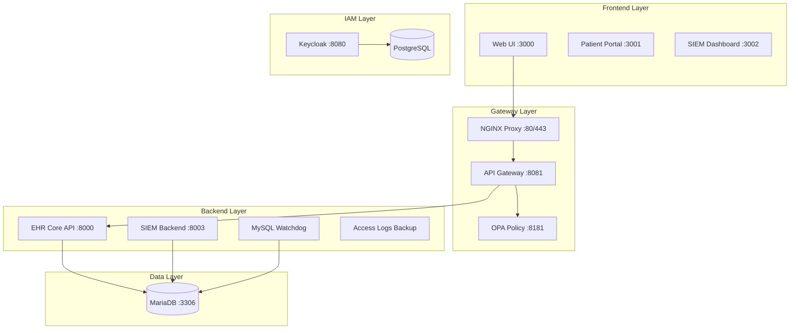
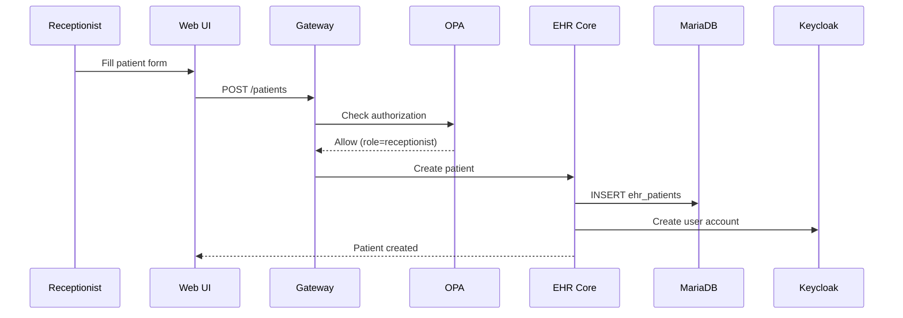
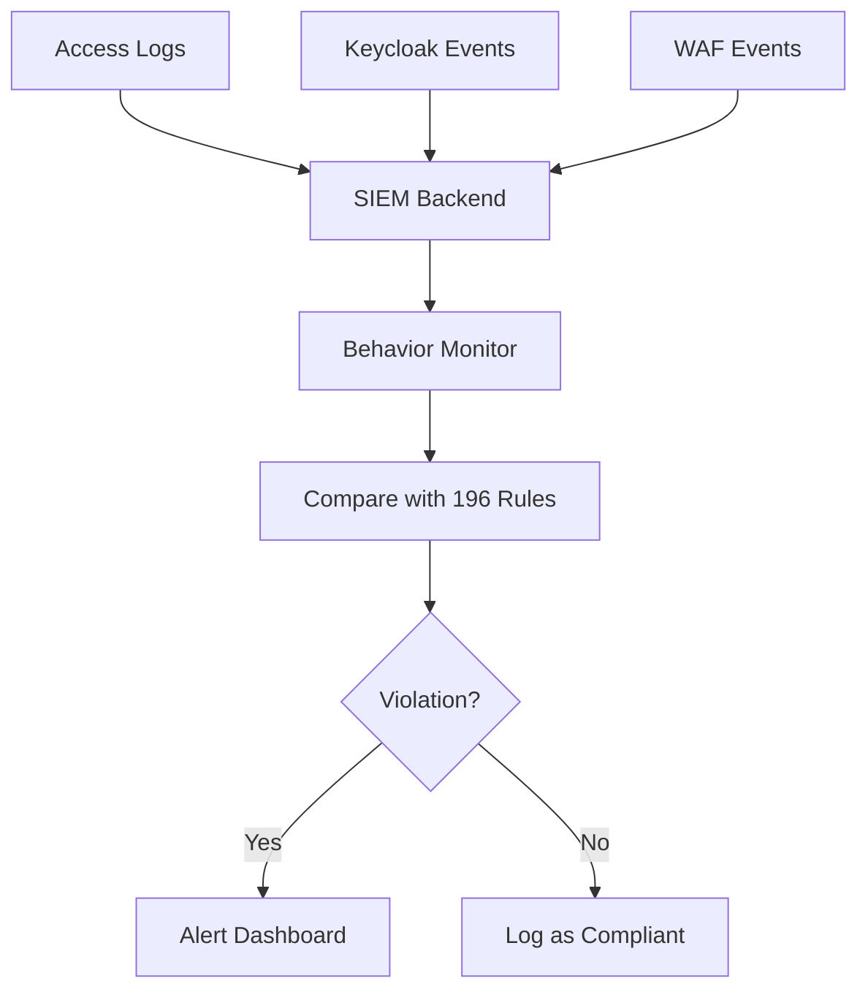
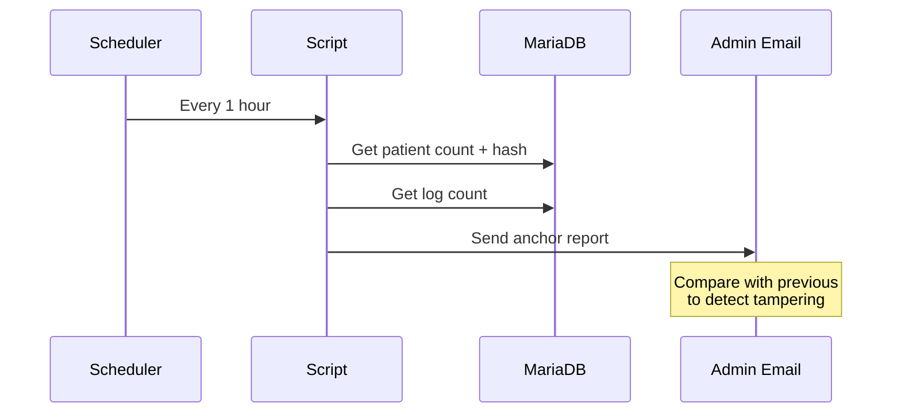
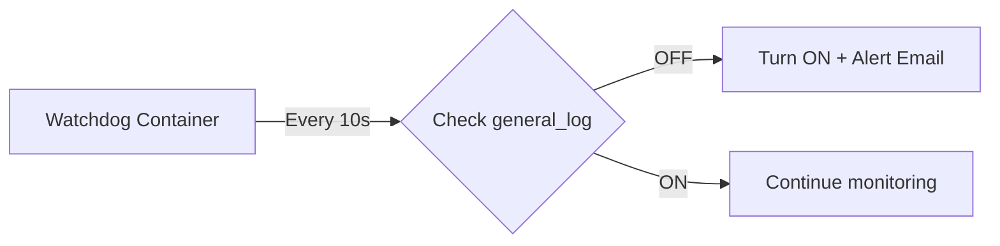

# EHR System Architecture & Code Flow Documentation

## System Overview

---

## Stack A: Gateway & IAM

### 1. Keycloak (Identity & Access Management)

| Component | Path | Description |
|-----------|------|-------------|
| Realm Config | [realm-ClinicRealm.json](file:///g:/DoAnVV/sunflower2_full/ehr_migration_package/linh/keycloak/realm-ClinicRealm.json) | Users, roles, clients |

**Roles**: `admin`, `doctor`, `nurse`, `receptionist`, `pharmacist`, `patient`

**Clients**: `web-ui`, `patient-portal`, `siem-dashboard`

---

### 2. OPA Policy (Authorization)

| File | Lines | Description |
|------|-------|-------------|
| [policy.rego](file:///g:/DoAnVV/sunflower2_full/ehr_migration_package/ehr-gw/opa/policies/policy.rego) | ~1200 | RBAC policy rules |
| [helpers.rego](file:///g:/DoAnVV/sunflower2_full/ehr_migration_package/ehr-gw/opa/policies/helpers.rego) | ~180 | Helper functions |

**Flow**: Request → Gateway → OPA → Allow/Deny

---

### 3. Gateway (NGINX + Lua)

| File | Description |
|------|-------------|
| [nginx.conf](file:///g:/DoAnVV/sunflower2_full/ehr_migration_package/ehr-gw/nginx.conf) | Routing config |
| [opa_auth.lua](file:///g:/DoAnVV/sunflower2_full/ehr_migration_package/ehr-gw/gateway/lua/opa_auth.lua) | OPA integration |

---

## Stack B: EHR Core

### Main API: [main.py](file:///g:/DoAnVV/sunflower2_full/ehr_migration_package/ehr-on-windows/ehr-core/app/main.py) (3,745 lines, 75 endpoints)

| Category | Endpoints | Lines |
|----------|-----------|-------|
| **Patients** | `GET/POST /patients`, `/patients/{id}` | 490-1330 |
| **Appointments** | `GET/POST /appointments` | 218-487 |
| **Nurse Screening** | `/appointments/{id}/screening` | 1362-1474 |
| **Internal Medicine** | `/internal-medicine/*` | 1477-2200 |
| **Prescriptions** | `/prescriptions/*` | 2800-3200 |
| **Medical Records** | `/medical-records/*` | 2400-2800 |
| **WAF Logging** | `/waf-event` | 53-155 |
| **Auth Logging** | `/login/log` | 158-199 |

---

## Stack C: SIEM & Analytics

### SIEM Backend: [main.py](file:///g:/DoAnVV/sunflower2_full/ehr_migration_package/Stack_C/backend/app/main.py) (1,092 lines, 54 endpoints)

| Category | Key File | Description |
|----------|----------|-------------|
| **Security Monitoring** | [security_monitor.py](file:///g:/DoAnVV/sunflower2_full/ehr_migration_package/Stack_C/backend/app/security_monitor.py) | Access logs analysis |
| **Behavior Analysis** | [behavior_monitor.py](file:///g:/DoAnVV/sunflower2_full/ehr_migration_package/Stack_C/backend/app/behavior_monitor.py) | User behavior vs rules |
| **Law Rules** | [law_rules.py](file:///g:/DoAnVV/sunflower2_full/ehr_migration_package/Stack_C/backend/app/law_rules.py) | 196 compliance rules |
| **Keycloak Events** | [keycloak_collector.py](file:///g:/DoAnVV/sunflower2_full/ehr_migration_package/Stack_C/backend/app/keycloak_collector.py) | Auth events |
| **AI Analysis** | [ai/](file:///g:/DoAnVV/sunflower2_full/ehr_migration_package/Stack_C/backend/app/ai) | Gemini/OpenAI integration |

---

## Web UI Pages

### [web-ui/src/pages/](file:///g:/DoAnVV/sunflower2_full/web-ui/src/pages) (36 pages)

| Page | Size | Use Case |
|------|------|----------|
| [Dashboard.js](file:///g:/DoAnVV/sunflower2_full/web-ui/src/pages/Dashboard.js) | 40KB | Main dashboard |
| [Patients.js](file:///g:/DoAnVV/sunflower2_full/web-ui/src/pages/Patients.js) | 52KB | Patient CRUD |
| [MedicalRecords.js](file:///g:/DoAnVV/sunflower2_full/web-ui/src/pages/MedicalRecords.js) | 59KB | Medical records |
| [Billing.js](file:///g:/DoAnVV/sunflower2_full/web-ui/src/pages/Billing.js) | 43KB | Payment processing |
| [Appointments.js](file:///g:/DoAnVV/sunflower2_full/web-ui/src/pages/Appointments.js) | 23KB | Appointment booking |
| [NurseScreening.js](file:///g:/DoAnVV/sunflower2_full/web-ui/src/pages/NurseScreening.js) | 17KB | Nurse screening |
| [PrescriptionWorkspace.js](file:///g:/DoAnVV/sunflower2_full/web-ui/src/pages/PrescriptionWorkspace.js) | 39KB | Doctor prescriptions |

---

## Use Cases & Code Flows

### UC1: Patient Registration

**Code**: [main.py#L875-986](file:///g:/DoAnVV/sunflower2_full/ehr_migration_package/ehr-on-windows/ehr-core/app/main.py#L875-986) `create_patient()`

---

### UC2: Medical Examination Flow

| Step | Page | API |
|------|------|-----|
| 1. Appointment | [Appointments.js](file:///g:/DoAnVV/sunflower2_full/web-ui/src/pages/Appointments.js) | `POST /appointments` |
| 2. Screening | [NurseScreening.js](file:///g:/DoAnVV/sunflower2_full/web-ui/src/pages/NurseScreening.js) | `PUT /appointments/{id}/screening` |
| 3. Diagnosis | [PrescriptionWorkspace.js](file:///g:/DoAnVV/sunflower2_full/web-ui/src/pages/PrescriptionWorkspace.js) | `POST /prescriptions` |
| 4. Pharmacy | [Pharmacy.js](file:///g:/DoAnVV/sunflower2_full/web-ui/src/pages/Pharmacy.js) | `PUT /prescriptions/{id}/dispense` |
| 5. Billing | [Billing.js](file:///g:/DoAnVV/sunflower2_full/web-ui/src/pages/Billing.js) | `POST /bills` |

---

### UC3: Security Monitoring (SIEM)

**Code**: [behavior_monitor.py](file:///g:/DoAnVV/sunflower2_full/ehr_migration_package/Stack_C/backend/app/behavior_monitor.py)

---

### UC4: Anchor Hash Email (Tamper Detection)

**Code**: [send_anchor_hash.ps1](file:///g:/DoAnVV/sunflower2_full/scripts/send_anchor_hash.ps1)

---

### UC5: Watchdog Auto-Recovery

**Code**: [watchdog.sh](file:///g:/DoAnVV/sunflower2_full/ehr_migration_package/watchdog/watchdog.sh)

---

## Database Tables

| Table | Purpose |
|-------|---------|
| `ehr_patients` | Patient records |
| `ehr_appointments` | Appointments |
| `ehr_encounters` | Medical encounters |
| `ehr_prescriptions` | Prescriptions |
| `access_logs` | Access audit logs |
| `siem_law_rules` | 196 compliance rules |
| `watchdog_alerts` | Log tampering alerts |
| `ip_blacklist` | Blocked IPs |

---

## Port Summary

| Port | Service |
|------|---------|
| 80/443 | NGINX Proxy |
| 3000 | Web UI |
| 3001 | Patient Portal |
| 3002 | SIEM Dashboard |
| 8000 | EHR Core API |
| 8003 | SIEM Backend |
| 8080 | Keycloak |
| 8081 | API Gateway |
| 8181 | OPA |
| 3306 | MariaDB |
